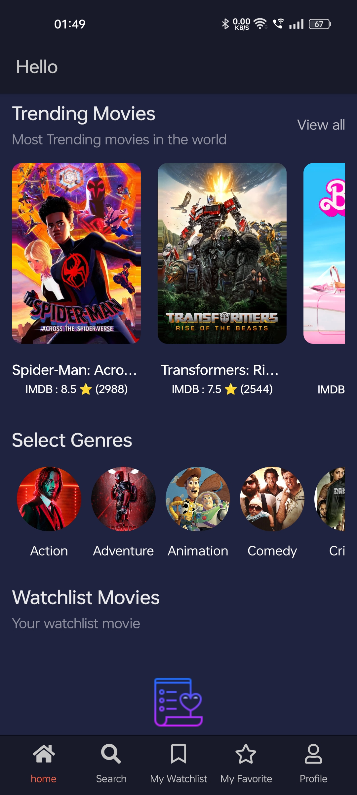
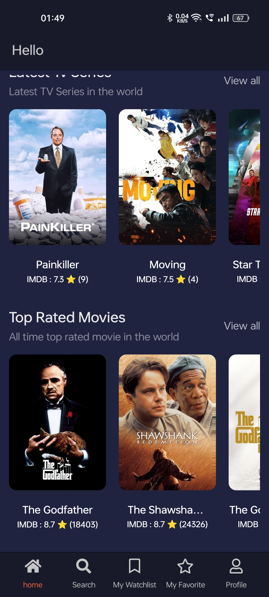
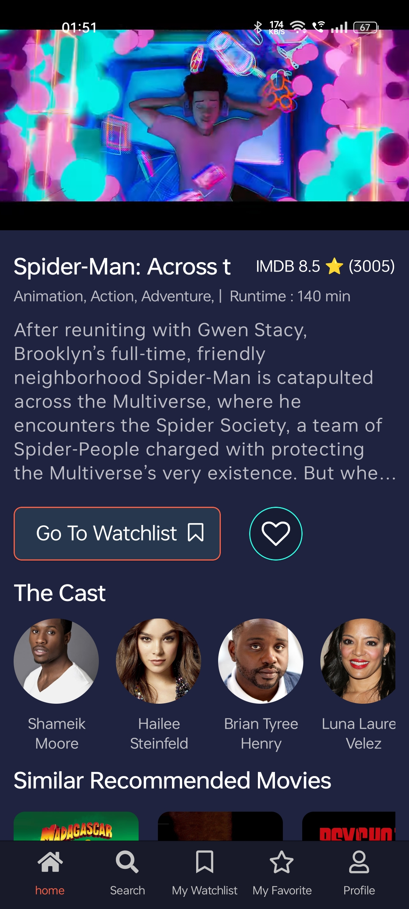
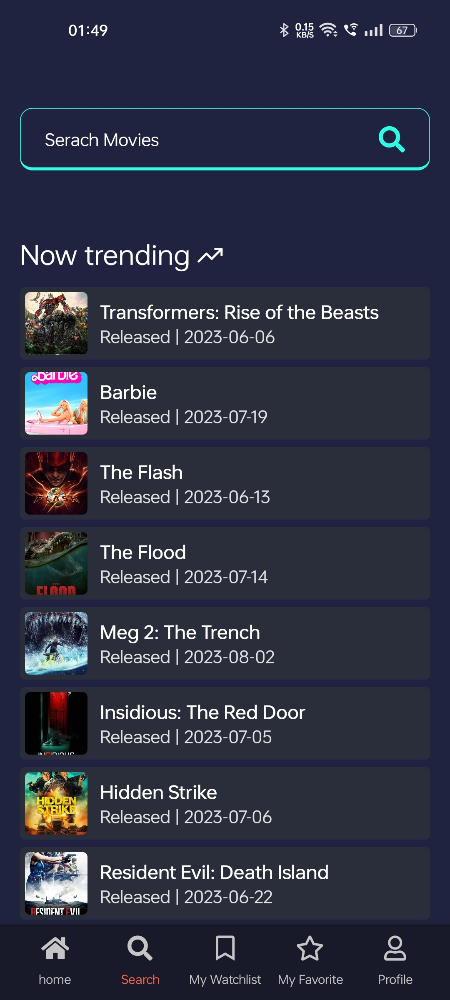
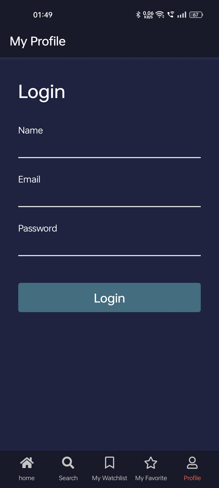
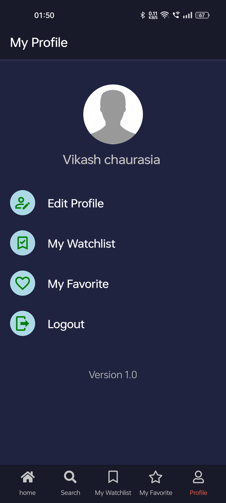

# Movie App

Welcome to **Movie App**, a React Native application that allows you to explore and discover trending movies, view movie details, and manage your watchlist. The app integrates various technologies including Redux for state management, TRK Query for API requests, and TMDB API for movie data.

<!--  -->

## Screenshots

<div style="display: flex; justify-content: space-between; width : full; gap: 40">
  
  
  
</div>

<div style="display: flex; justify-content: space-between; width : full; gap: 40">
  
  
  
</div>


## Technologies Used

- **React Native:** Building the user interface and application logic.
- **Redux:** Managing state for a consistent and scalable data flow.
- **TRK Query:** Handling API requests and responses effectively.
- **TMDB API:** Integrating movie data into the app.
- **CSS:** Styling and layout for a visually appealing design.


## Features

- Search and explore the latest trending movies.
- View detailed information about movies including cast, runtime, and trailers.
- Bookmark or add movies to your watchlist for future reference.
- User authentication required to add movies to the watchlist.

## Getting Started

To get started with the Movie App, follow these steps:

1. Clone the repository:
   ```bash
   git clone https://github.com/yourusername/movie-app.git
   cd movie-app

2. npm install

3. npx expo start